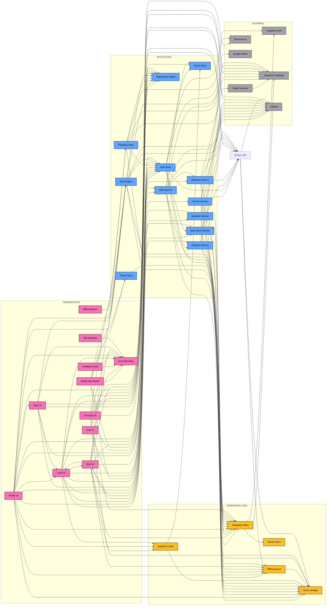

# Harvi Architecture Charts

> **Note to AI Agents**: This file is auto-generated by the governance engine (`graphing/verify_graph.js`).

## 📊 Architecture Diagram

```mermaid
flowchart LR

  %% Styling Classes
  classDef presentation fill:#f472b6,stroke:#831843,stroke-width:2px,color:#000
  classDef application fill:#60a5fa,stroke:#1e3a8a,stroke-width:2px,color:#000
  classDef infrastructure fill:#fbbf24,stroke:#78350f,stroke-width:2px,color:#000
  classDef external fill:#a1a1aa,stroke:#3f3f46,stroke-width:2px,color:#000

  subgraph PRESENTATION
    direction TB
    app["Mobile App Router"]:::presentation
    tab_navigator["Tab Navigator"]:::presentation
    auth_feature["Auth UI"]:::presentation
    learn_feature["Learn UI"]:::presentation
    quiz_feature["Quiz UI"]:::presentation
    stats_feature["Stats UI"]:::presentation
    purchase_feature["Purchase UI"]:::presentation
    profile_feature["Profile UI"]:::presentation
    error_boundary["Error Boundary"]:::presentation
    offline_banner["Offline Banner"]:::presentation
    feedback_form["Feedback Form"]:::presentation
  end

  subgraph APPLICATION
    direction TB
    auth_store["Auth Store"]:::application
    sync_store["Sync Engine"]:::application
    purchase_store["Purchase Store"]:::application
    cache_store["Cache Store"]:::application
    theme_store["Theme Store"]:::application
    react_query["React Query Client"]:::application
    hierarchy_service["Hierarchy Service"]:::application
    access_service["Access Service"]:::application
    progress_service["Progress Service"]:::application
    best_score_service["Best Score Service"]:::application
    question_service["Question Service"]:::application
    stats_service["Stats Service"]:::application
  end

  subgraph INFRASTRUCTURE
    direction TB
    question_cache["Question Cache"]:::infrastructure
    offline_queue["Offline Queue"]:::infrastructure
    supabase_client["Supabase Client"]:::infrastructure
    secure_store["Secure Store"]:::infrastructure
    async_storage["Async Storage"]:::infrastructure
  end

  subgraph EXTERNAL
    direction TB
    supabase_auth["Supabase Auth"]:::external
    supabase_db["Supabase Database"]:::external
    supabase_functions["Edge Functions"]:::external
    revenuecat["RevenueCat"]:::external
    netinfo["NetInfo"]:::external
    google_oauth["Google OAuth"]:::external
  end

  app --> error_boundary
  app --> react_query
  app --> auth_store
  app --> purchase_store
  app --> sync_store
  app --> theme_store
  auth_feature --> auth_store
  auth_store --> supabase_client
  auth_store --> cache_store
  supabase_client --> secure_store
  supabase_client --> supabase_auth
  supabase_client --> supabase_db
  auth_store --> google_oauth
  learn_feature --> hierarchy_service
  learn_feature --> access_service
  learn_feature --> auth_store
  learn_feature --> quiz_feature
  quiz_feature --> question_service
  quiz_feature --> question_cache
  quiz_feature --> supabase_client
  quiz_feature --> auth_store
  quiz_feature --> sync_store
  quiz_feature --> react_query
  stats_feature --> cache_store
  stats_feature --> auth_store
  stats_feature --> sync_store
  stats_service --> supabase_client
  stats_service --> cache_store
  stats_service --> async_storage
  stats_service --> offline_queue
  stats_service --> hierarchy_service
  stats_service --> netinfo
  purchase_feature --> purchase_store
  purchase_store --> supabase_client
  purchase_store --> auth_store
  purchase_store --> react_query
  supabase_functions --> supabase_db
  profile_feature --> auth_store
  profile_feature --> async_storage
  profile_feature --> theme_store
  profile_feature --> sync_store
  profile_feature --> supabase_client
  profile_feature --> stats_service
  profile_feature --> best_score_service
  profile_feature --> question_cache
  profile_feature --> offline_queue
  profile_feature --> react_query
  sync_store --> supabase_client
  sync_store --> auth_store
  sync_store --> netinfo
  sync_store --> react_query
  hierarchy_service --> supabase_client
  hierarchy_service --> async_storage
  hierarchy_service --> netinfo
  access_service --> supabase_client
  access_service --> async_storage
  access_service --> netinfo
  progress_service --> supabase_client
  progress_service --> async_storage
  progress_service --> offline_queue
  progress_service --> netinfo
  best_score_service --> supabase_client
  best_score_service --> async_storage
  best_score_service --> offline_queue
  best_score_service --> netinfo
  question_service --> supabase_client
  question_service --> async_storage
  question_service --> netinfo
  question_cache --> async_storage
  question_cache --> cache_store
  offline_queue --> async_storage
  theme_store --> async_storage
  purchase_feature --> auth_store
  purchase_feature --> supabase_client
  learn_feature --> react_query
  learn_feature --> netinfo
  purchase_feature --> revenuecat
  purchase_feature --> async_storage
  purchase_feature --> netinfo
  purchase_feature --> react_query
  stats_feature --> react_query
  profile_feature --> stats_feature
  profile_feature --> learn_feature
  quiz_feature --> learn_feature
  stats_feature --> learn_feature
  auth_feature --> error_boundary
  feedback_form --> error_boundary
  learn_feature --> error_boundary
  profile_feature --> error_boundary
  purchase_feature --> error_boundary
  quiz_feature --> error_boundary
  stats_feature --> error_boundary
  tab_navigator --> error_boundary
  auth_store --> best_score_service
  auth_store --> progress_service
  learn_feature --> best_score_service
  learn_feature --> progress_service
  learn_feature --> question_cache
  purchase_store --> revenuecat
  question_service --> quiz_feature
  quiz_feature --> offline_queue
  stats_feature --> stats_service
  sync_store --> offline_queue
  access_service --> shared_utils
  auth_store --> shared_utils
  best_score_service --> shared_utils
  hierarchy_service --> shared_utils
  learn_feature --> shared_utils
  progress_service --> shared_utils
  purchase_feature --> shared_utils
  question_service --> shared_utils
  shared_utils --> async_storage
  shared_utils --> netinfo
  shared_utils --> offline_queue
  stats_service --> shared_utils
  sync_store --> shared_utils
  offline_banner --> sync_store
  access_service --> supabase_db
  auth_store --> supabase_auth
  hierarchy_service --> supabase_db
  profile_feature --> supabase_db
  purchase_store --> supabase_db
  purchase_store --> supabase_functions
  quiz_feature --> supabase_db
  stats_service --> supabase_db
  sync_store --> supabase_db
```

