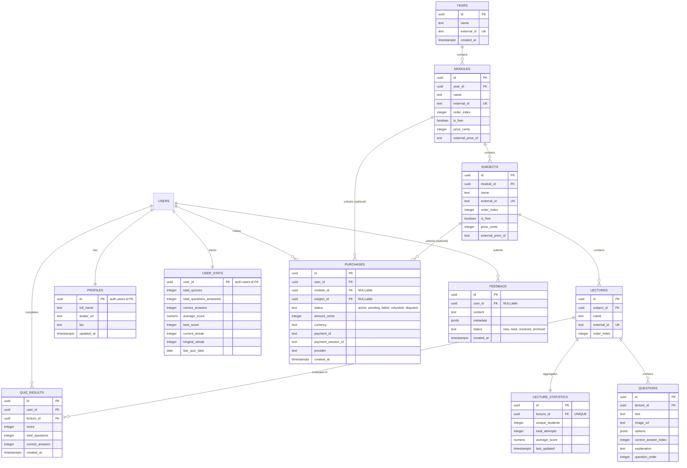

# 🏛️ Harvi System Design & Scalability Analysis

This document provides a comprehensive technical overview of the **Harvi** platform architecture, detailing the frontend mobile setup, backend serverless infrastructure, database schema, security boundaries, and a detailed mathematical cost/scalability analysis.

---

## 🗺️ Architectural Topology

Harvi is designed as a **serverless, client-direct-to-database** mobile application, leveraging **Supabase** (Postgres + Auth + Realtime + Edge Functions) for zero-infrastructure maintenance, combined with **Stripe/Paymob** for secure monetization.

```mermaid
graph TD
    %% Clients
    subgraph Client Layer
        App[Expo Mobile App / React Native]
    end

    %% Supabase Gateway
    subgraph Supabase BaaS Layer
        Auth[Supabase Auth]
        DB[(PostgreSQL Database)]
        Realtime[Supabase Realtime]
    end

    %% Serverless Edge Functions
    subgraph Serverless Backend
        CheckoutFunc[create-checkout Edge Function]
        WebhookFunc[payment-webhook Edge Function]
        VerifyFunc[verify-purchase Edge Function]
    end

    %% External Payments
    subgraph Payment Processor
        Stripe[Stripe / Paymob APIs]
    end

    %% Client Connections
    App -->|JWT Session / Direct Queries| DB
    App -->|Auth Requests| Auth
    App -->|Call Checkout / Verify| Serverless Backend
    App -->|Realtime Heartbeats| Realtime

    %% Edge Function Operations
    CheckoutFunc -->|Service Role Key: Insert Purchase| DB
    WebhookFunc -->|HMAC Verification / Update status| DB
    VerifyFunc -->|Check DB status / Stripe fallback| DB

    %% External APIs
    CheckoutFunc -->|Create Payment Session| Stripe
    Stripe -->|HMAC Verified Webhooks| WebhookFunc
```

---

## 🗄️ Database Schema & Relationships

The database utilizes a strict academic hierarchy combined with student performance tracking and transaction auditing. 

### Entity-Relationship Diagram



---

## ⚡ High-Performance Scaling Patterns

To maintain instant UI responses, the platform implements database-level aggregation triggers and optimization indexes:

1. **Trigger-to-Table Aggregation (Pay-on-Write)**:
   Instead of running expensive `SELECT COUNT(*)` or `AVG()` queries across thousands of rows when loading student dashboards, Harvi uses PostgreSQL triggers:
   * **`tr_sync_user_stats`**: Automatically updates `user_stats` (quiz count, streaks, scores) when a row is inserted into `quiz_results`.
   * **`tr_sync_lecture_stats`**: Maintains global `lecture_statistics` in real time upon quiz completion.
   * *Performance Impact:* Redefines reading dashboards from an $O(N)$ query (where $N$ is quiz attempts) to an $O(1)$ read.

2. **Cron-Based Data Retention (`pg_cron`)**:
   * Storing quiz results infinitely is a scaling bottleneck. The database schedules a weekly cleanup cron job:
     ```sql
     SELECT cron.schedule('harvi-weekly-cleanup', '0 3 * * 0', $$
         DELETE FROM public.quiz_results WHERE created_at < NOW() - INTERVAL '1 year';
         DELETE FROM public.feedback WHERE created_at < NOW() - INTERVAL '1 year';
     $$);
     ```
   * *Performance Impact:* Automatically caps user-generated database growth, keeping index size and scan times deterministic.

3. **Strategic Indexing**:
   * Specialized compound index `idx_quiz_results_user_date` on `(user_id, created_at DESC)` for high-speed chronological feeds.
   * Partial indexes `idx_purchases_user_subject_status` and `idx_purchases_user_module_status` filtered `WHERE status = 'active'` to verify content permissions instantly.

---

## 🔒 Security & Data Isolation (Row Level Security)

Harvi implements absolute security boundaries directly in the database layer. Even if the mobile app client is decompiled or modified, users cannot read other students' data or access premium academic content unauthorized.

* **Hardened Admin Role Detection (`is_admin()`)**:
  Bypasses client-side JWT manipulation by querying the authenticated user’s metadata directly from `auth.users` (`raw_app_meta_data ->> 'role' = 'admin'`), which is only editable via backend `service_role` credentials.
* **Master Content Gatekeeper (`check_content_access()`)**:
  Protects the `questions` table using a database-level function:
  ```sql
  CREATE POLICY "questions_gated_access" ON public.questions 
  FOR SELECT TO authenticated 
  USING (check_content_access(lecture_id));
  ```
  This function automatically grants access if:
  1. The user is an Admin.
  2. The target `module` or `subject` is flagged as `is_free = true`.
  3. The user has an active row in the `purchases` table for the corresponding `module_id` or `subject_id`.
* **Private User Isolation**:
  Tables like `quiz_results`, `profiles`, and `user_stats` utilize strict RLS policies limiting operations to users where `auth.uid() = user_id`.

---

## 📈 Scalability & Financial Capacity Analysis
### ("How many users my app can afford?")

The system's operating costs are split into two categories: **Transactional (Payment Fees)** and **Infrastructure (Supabase Hosting & App Distribution)**.

### 1. Transactional Costs (Pay-As-You-Go)
Payment processors (Stripe/Paymob) operate on a fixed percentage plus per-transaction fee:
* **Stripe Standard:** $2.9\% + \$0.30$ per transaction.
* **Paymob Standard:** $\approx 2.75\% + \text{fixed fee}$.
Because these fees are only incurred when a student makes a purchase, **the app can afford an infinite number of transactions**. This cost scales perfectly with your revenue.

---

### 2. Infrastructure Capacity & Cost Projections
Supabase is the primary infrastructure component. Let's analyze limits on the **Free Tier** vs. **Pro Tier**.

#### A. Database Storage Calculations
Let's estimate the storage footprint per user:
* **Static Content (Curriculum):** Years, Modules, Subjects, Lectures, Questions. 10,000 questions + images, metadata $\approx$ **25 MB** (practically static).
* **Profile & Streaks:** $\approx$ **500 bytes** per user (inserted once).
* **Quiz Results (Daily Activity):**
  * Average raw row size in `quiz_results` (including index footprint) $\approx$ **300 bytes**.
  * Assuming an active student completes **2 quizzes/day**, they generate:
    $$\text{Storage per active user per year} = 2 \text{ quizzes/day} \times 365 \text{ days} \times 300 \text{ bytes} \approx 219 \text{ KB/user/year}$$
  * Due to the **1-year pg_cron retention policy**, this storage size is capped and does not grow infinitely.

| Metric | Supabase Free Tier ($0/mo) | Supabase Pro Tier ($25/mo) | Pay-As-You-Go Overages |
| :--- | :--- | :--- | :--- |
| **Database Space** | 500 MB | 8 GB | +$0.125 / GB |
| **Max Active Students (Daily Quiz)** | **$\approx 2,100$ students** | **$\approx 36,000$ students** | Unlimited |
| **Max Casual Students (50 quizzes/yr)** | **$\approx 30,000$ students** | **$\approx 530,000$ students** | Unlimited |

---

#### B. Connection and Egress Limits
Beyond database space, web applications hit limits on active connections, bandwidth, and API calls.

##### 1. Monthly Active Users (MAU)
* **Free Tier:** 50,000 MAUs included.
* **Pro Tier:** 100,000 MAUs included. (Overages: $0.00325 per user).
* *Verdict:* Free tier can support **50,000 total signed-up users** before requiring upgrade.

##### 2. Realtime Concurrent Connections (Heartbeats/Enrollments)
* **Free Tier:** 200 concurrent connections.
* **Pro Tier:** 500 concurrent connections included. (Overages: $10 per 1,000 concurrent).
* *Math:* If a student session lasts 5 minutes, 200 concurrent connections can accommodate:
  $$\frac{60 \text{ mins}}{5 \text{ mins}} \times 200 \text{ connections} = 2,400 \text{ active users per hour}$$
  Assuming typical diurnal traffic curves, this supports up to **15,000 - 20,000 Daily Active Users (DAU)**.

##### 3. Edge Function Invocations
* Invocations only happen on purchases (`create-checkout`, `verify-purchase`, `payment-webhook`).
* **Free Tier:** 500,000 calls/month.
* **Pro Tier:** 2 Million calls/month.
* *Verdict:* Far exceeds any volume expected for purchase flows (which average $< 10$ calls per user lifespan).

---

## 🏁 Summary Matrix: Capacity vs. Monthly Cost

Here is how many users the Harvi app can support based on your financial budget:

| Tier | Infrastructure Cost | Max Active Users (MAU) | Storage Limit | Estimated Concurrent Users | Verdict |
| :--- | :--- | :--- | :--- | :--- | :--- |
| **Free Tier** | **$0 / month** | **50,000** | 500 MB | 200 | **Excellent for MVP / Beta Launch.** Can comfortably support up to **2,000 highly active** students or **30,000 casual** students. |
| **Pro Tier** | **$25 / month** | **100,000** | 8 GB | 500 | **Production Standard.** Supports up to **36,000 active** users. Scales elastically; adding another 10,000 active students only costs a few cents in database storage. |
| **Enterprise / Custom** | **$100 - $300 / month** | **250,000+** | Custom (e.g. 50GB) | 2,000+ | **Mass Scale.** Ready for nationwide academic deployment. |

### 🛠️ Optimization Recommendations to Maximize User Capacity
1. **Paginating Question Retrieval:** Ensure the mobile client retrieves questions page-by-page or quiz-by-quiz, rather than downloading entire modules, to save egress bandwidth.
2. **Optimize Image Assets:** Store question images in Supabase Storage optimized in `.webp` format and fetch them using CDN caching to minimize database query size.
3. **Index Maintenance:** Re-index tables periodically via a cron job once database entries exceed 5,000,000 rows to ensure querying remains under $15\text{ms}$.
