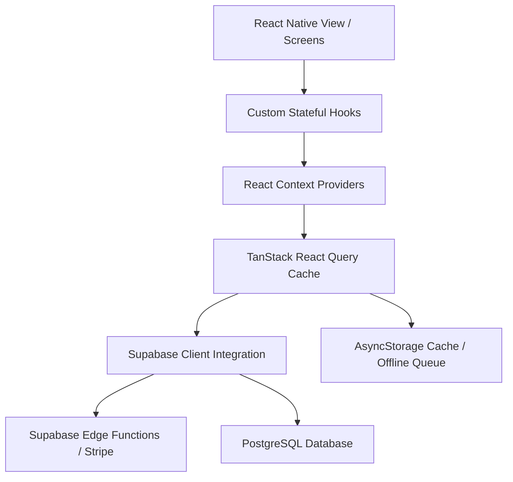

# Application Architecture Blueprint: Reusable OS Core

This document details the core architectural standards, data flows, and system patterns of the **Harvi** mobile application. Future AI agents must follow this architectural blueprint strictly when generating features or creating new applications.

---

## 1. System Philosophy & Technology Stack

The application is engineered as a high-performance, offline-first, highly secured medical learning app. It leverages a modern, native-first stack:



### Core Technologies
1.  **Core Framework**: Expo SDK 54 (`expo: ~54.0.27`) with React 19 (`react: 19.1.0`).
2.  **Navigation**: Expo Router v6 (`expo-router: ~6.0.17`) employing a hybrid structure (Frosted glass bottom tab bar + native stack presentation modals).
3.  **Data Fetching & Cache**: TanStack React Query v5 (`@tanstack/react-query: ^5.90.21`).
4.  **Backend & Database**: Supabase JS Client (`@supabase/supabase-js: ^2.105.1`) with PostgreSQL and Edge Functions (Stripe payments).
5.  **Offline State & Persistence**: `@react-native-async-storage/async-storage: 2.2.0` and `@react-native-community/netinfo: ^11.4.1`.
6.  **Animation & Gestures**: React Native Reanimated v4 (`react-native-reanimated: ~4.1.1`) and Gestures handler (`react-native-gesture-handler: ~2.28.0`).

---

## 2. Dynamic Schema & Data Resiliency

A defining architectural decision in Harvi is **Dynamic Column Mapping**. Mobile clients are notoriously difficult to update instantly when a database schema changes. To prevent app crashes, the data layers dynamically probe candidate columns.

### Code Example: Probing Schema Candidates
When fetching quiz questions or completing lectures, the application checks several column variants to map keys dynamically:

```typescript
const LECTURE_FK_CANDIDATES = ["lecture_id", "subject_id", "topic_id", "lesson_id", "lec_id", "content_id"];
const TEXT_CANDIDATES = ["text", "question", "body", "content", "question_text"];
const OPTIONS_CANDIDATES = ["options", "answers", "choices", "opts"];

export function pick(row: Record<string, unknown>, candidates: string[]): unknown {
  for (const c of candidates) {
    if (c in row) return row[c];
  }
  return null;
}
```

### 🧠 Advanced Architectural Reasoning
*   **Decoupled Client-Database lifecycles**: If a database administrator renames `lecture_id` to `lesson_id` or `text` to `question_text` on the Postgres server to support new admin panel features, the client automatically adjusts at runtime, eliminating the need for emergency native App Store submissions.
*   **Drift Failure Handling**: If *none* of the candidate columns are detected, the system intercepts the parse loop inside the hook, logs the failure telemetry payload to the server, and serves a structurally safe, default empty state rather than throwing a JS null-property parsing crash.

---

## 3. Offline-First Core Loop

Harvi maintains instant UI responses by bypassing Supabase networks completely when offline. The architecture splits network requests into a **Dynamic Caching Architecture**:

```
[Fetch Trigger]
       │
       ├──► 1. Check Network Connectivity via NetInfo
       │
       ├──► [OFFLINE] ──► Instant Cache Service (AsyncStorage + memCache Map)
       │
       └──► [ONLINE]  ──► Supabase Fetch ──► Save Questions/Progress to Cache
```

### ⚖️ Tradeoff Analysis: Offline Consistency vs Data Freshness
*   **The Problem**: Reading local cache is fast but risks serving stale data (e.g. out-of-date subscription status).
*   **The Mitigation**: Harvi uses a tiered validity system:
    1.  *Educational content (Lectures/Quizzes)*: Long-lived caching. Cache is marked valid for 24 hours. The app works 100% offline.
    2.  *Billing & Access Maps*: Dynamic check. The system pre-warms the cache on mount, but executes a background fetch check (network preflight) on checkout click, preventing offline purchase spoofing.
*   **Offline Mutation Resilience**: Quiz progress completed offline is queued locally in AsyncStorage. A centralized observer watches network connectivity state and synchronizes mutations immediately upon network return.

---

## 4. Secure & Encrypted Client State

To maintain educational integrity and prevent cheating, all correct quiz answers and explanations are encrypted using a lightweight client-side XOR-cipher prior to storage or memory transmission:

```typescript
const XOR_KEY = "harvi-quiz-secure-key-2024";

export function decryptAnswer(encrypted: string): { answer: number; explanation: string } {
  try {
    const decoded = atob(encrypted);
    let decrypted = "";
    for (let i = 0; i < decoded.length; i++) {
      decrypted += String.fromCharCode(
        decoded.charCodeAt(i) ^ XOR_KEY.charCodeAt(i % XOR_KEY.length)
      );
    }
    const parsed = JSON.parse(decrypted);
    return { answer: parsed.answer, explanation: parsed.explanation ?? "" };
  } catch {
    // Fallback path handling plain-text or unicode-safe formats
  }
}
```

---

## 5. Paywall Gating & Edge Functions Architecture

Harvi handles paywalls and purchases securely without loading heavy native dependencies using Supabase RPCs and Stripe checkout web interfaces:

1.  **RPC Gating**: Access lists are queried via `supabase.rpc("get_content_access_map")`, which aggregates modules, pricing, free tiers, and purchased grants.
2.  **Stripe Redirects**: Stripe checkout is launched in a secure WebBrowser sheet (`WebBrowser.openAuthSessionAsync`) pointing to a Supabase Edge Function `create-checkout` that returns a checkout session URL.
3.  **Verification Callback**: A verification function (`verify-purchase`) decodes Stripe's callback deep link, verifies the payment status server-side, grants database access, and invalidates local client queries.

---

## 6. AI Guidance & Implementation Heuristics

Future AI agents must follow this state management selection tree during generation:

```
                  ┌──────────────────────────────┐
                  │    Select Data Management    │
                  └──────────────┬───────────────┘
                                 │
                  Is the state shared across 3+ screens?
                  ├── Yes ──► Does it change > 2 times per second?
                  │           ├── Yes ──► Create local React shared hook
                  │           └── No  ──► Wrap inside a global React Context
                  │
                  └── No  ──► Is it queried from network databases?
                              ├── Yes ──► Use TanStack Query with custom pre-warm hook
                              └── No  ──► Standard local useState / useRef
```

---

# Anti-Patterns

*   **No Direct Fetch Calls**: Never use direct HTTP `fetch` or custom Axios instances in components or screens. All server communication must occur through the Supabase Client or TanStack React Query hooks.
    *   *Consequence*: Bypasses network request batching, duplicates connection slots, and breaks central offline/caching mechanisms.
*   **No Heavy Inline Animations**: Never trigger React state re-renders for animations. Always rely on Reanimated shared values (`useSharedValue`, `useAnimatedStyle`) to run on the native thread.
    *   *Consequence*: Starves the JavaScript thread, dropping frame rates from 120 FPS to under 30 FPS, especially during quick user interactions.
*   **No Unbounded SecureStore Writes**: Do not dump massive files or raw unchunked session objects into `SecureStore` (which has a strict 2KB limit on iOS).
    *   *Consequence*: Triggers silent native runtime crashes on iOS devices during persistent session saving, locking users out of the app. Always chunk data or use standard AsyncStorage for larger records.
*   **Implicit Database Traversal**: Fetching dynamic data grids without specifying selective column picking (e.g. using `select("*")` on large tables).
    *   *Consequence*: Saturation of the mobile data channel, slow layout rendering, and high server memory overhead. Always specify exact column strings (e.g. `select("id, name")`).
