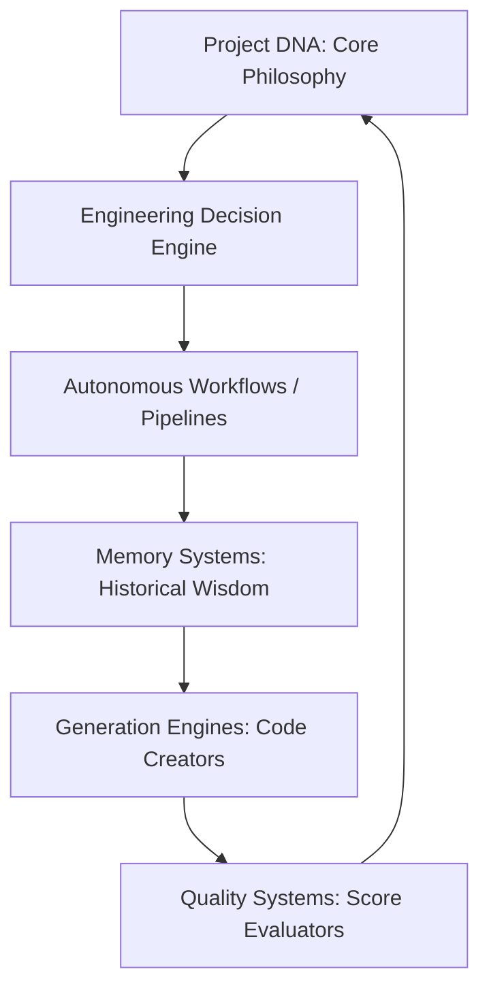

# App Factory Operating System: The Constitution of Autonomous Cognition

This document serves as the supreme **Constitution** of the Harvi AI App Factory OS. It defines the global connections, agent collaboration blueprints, generation lifecycles, and engineering governance required to orchestrate all software tasks.

---

## 1. Global Interconnection Model

The App Factory OS operates as a unified cognitive system. Every file, prompt, and generator must function in harmony, maintaining the following architectural paths:



### System Dependencies
*   **The Brain (Intelligence)**: Instructs **Workflows** on how to structure execution paths.
*   **The Pipelines (Workflows)**: Writes new telemetry patterns to **Memory** on every execution turn.
*   **The Memory (Experience)**: Injects historical lessons into the **Generation Engines** to prevent repeating past mistakes.
*   **The Scorecards (Quality)**: Audits outputs and determines if compilation tasks should pass or refactor.

---

## 2. Multi-Agent Collaboration Framework

When multiple AI agents or pair developers collaborate, they must operate under a strict **Role-Division Blueprint**:

*   **The Planner (CTO Agent)**: Decomposes product requests, estimates FCI complexity scores, and plans folder structures.
*   **The Builder (Developer Agent)**: Generates highly typed typescript structures and connects spring-loaded visual components.
*   **The Reviewer (QA Agent)**: Runs the self-review checklists, calculates quality metric scores, and marks tasks as approved or failed.

---

## 3. The App Generation Lifecycle

Every new project created by the App Factory OS must progress through **5 Structured Lifecycle Stages**:

```
        ┌────────────────────────────────────────────────────────┐
        │                  Stage 1: Ingestion                    │
        │  Read schemas, calculate FCI, identify dependencies    │
        └──────────────────────────┬─────────────────────────────┘
                                   │
                                   ▼
        ┌────────────────────────────────────────────────────────┐
        │                  Stage 2: Foundation                   │
        │  Scaffold folder structures, hooks, and barrel files   │
        └──────────────────────────┬─────────────────────────────┘
                                   │
                                   ▼
        ┌────────────────────────────────────────────────────────┐
        │                  Stage 3: Integration                  │
        │  Establish DB connection queries, types, and hooks     │
        └──────────────────────────┬─────────────────────────────┘
                                   │
                                   ▼
        ┌────────────────────────────────────────────────────────┐
        │                  Stage 4: Validation                   │
        │  Verify compilation, compute dynamic quality scores    │
        └──────────────────────────┬─────────────────────────────┘
                                   │
                                   ▼
        ┌────────────────────────────────────────────────────────┐
        │                    Stage 5: Release                    │
        │  Clean orphan elements, run EAS builds, ship to store   │
        └────────────────────────────────────────────────┘
```

---

## 4. Supreme Engineering Governance Rules

1.  **Strict File Length Limits**: No React layout file may exceed 350 lines. Large files must undergo immediate surgical modularization.
2.  **Zero hardcoded stylinghex values**: All colors, paddings, and font sizes must map to theme tokens (`colors.card`, `colors.primary`).
3.  **Strict Backward Compatibility**: Public functions and shared hooks must never break existing parameter signatures. Expand with optional configurations.
4.  **No Unbounded Storage**: Do not save unchunked dynamic data strings > 2KB in iOS SecureStore keys. Use chunked wrappers or AsyncStorage.
5.  **Always log exceptions**: Every captured crash or exception must log to Sentry telemetry before executing visual error banners.
